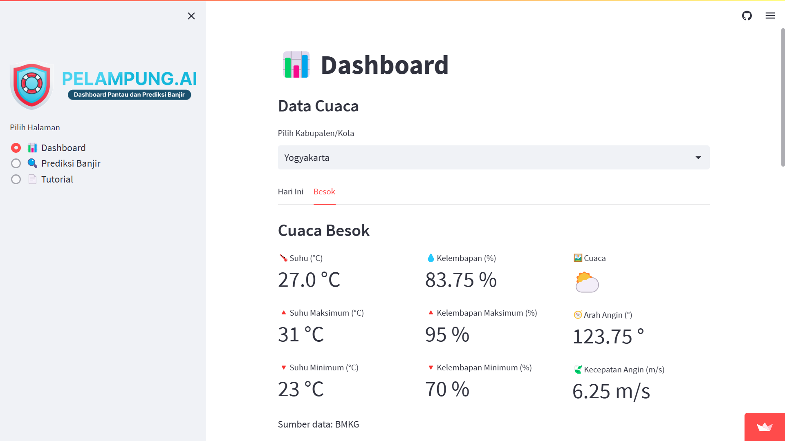

# Pelampung.AI

Pelampung.AI adalah proyek yang bertujuan untuk memprediksi dan menganalisis kejadian banjir di Indonesia menggunakan data historis dan teknik pembelajaran mesin. Proyek ini dikembangkan oleh kelompok mahasiswa sebagai bagian dari proyek akhir.

## Fitur



- Dashboard: Menampilkan visualisasi data dan statistik terkait kejadian banjir di Indonesia.
- Prediksi Banjir: Memprediksi kejadian banjir berdasarkan data historis dan faktor-faktor yang mempengaruhi.
- Tutorial: Panduan penggunaan dan dokumentasi proyek.

## Instalasi

1. Clone repositori ini ke lokal Anda:

   ```bash
   git clone https://github.com/dzakwanalifi/pelampung-ai.git

2. Masuk ke direktori proyek:
    ```bash
    cd pelampung-ai

3. Instal dependensi menggunakan pip:
    ```bash
    pip install -r requirements.txt

## Penggunaan

1. Jalankan aplikasi dengan perintah berikut:
    ```bash
    streamlit run app.py

2. Buka aplikasi di browser dengan URL berikut: http://localhost:8501

## Tim Pengembang

- Muhammad Dzakwan Alifi
- Indra Mahib Zuhair Riyanto
- Zaima Firoos Likan

## Dosen Pembimbing

Sachnaz Desta Oktarina, S.Stat., M.Agr., Ph.D.
